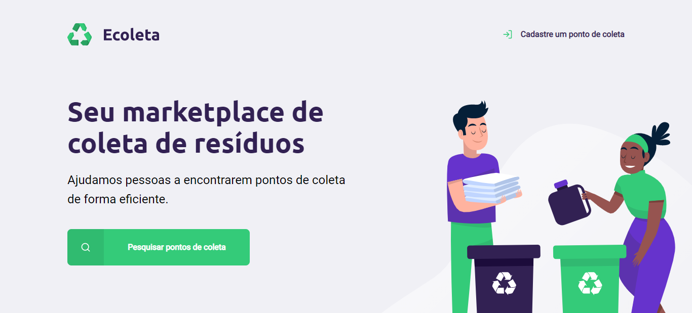

<h1 align="center">
    
</h1>

<h4>
    <p><li>Landing-page</li></p>
    
</h4>

# 💻 Index
- [About](#-About)
- [How to create a new point of collect](#-how-to-create-a-new-point-of-collect)
- [Technologies used](#-technologies-used)
- [How to use](#-how-to-use)
- [Credits](#credits)

---

## 📝 About

The project Ecoleta was developed during the **International environment day**. Te objective is connect people with companies that collect specific waste.

---

## 🔬 How to create a new point of collect

- Informations required:
1. Entity name;
2. Image from the entity;
3. Address;
4. State and city

- Select the type of waste the company collect:
1. Lamps
2. Batteries
3. Papers and carboard
4. Eletronic wastes
5. Organics wastes
6. Kitchen oil 

---

## 📚 Technologies used

- HTML
- CSS
- Javascript

---

## ⌨ How to use
```bash

# Clone repository
$ git clone https://github.com/LuisFernandoChagas/NLW-1.git

# Access directory
$cd ./NLW-1

# Dependencies
$ npm install

# Run code
$ npm run dev

```

### Credits😄

Website developed during the **NLW#1** by Luis Chagas. Project created by [🚀Rocketseat](https://rocketseat.com.br/)
